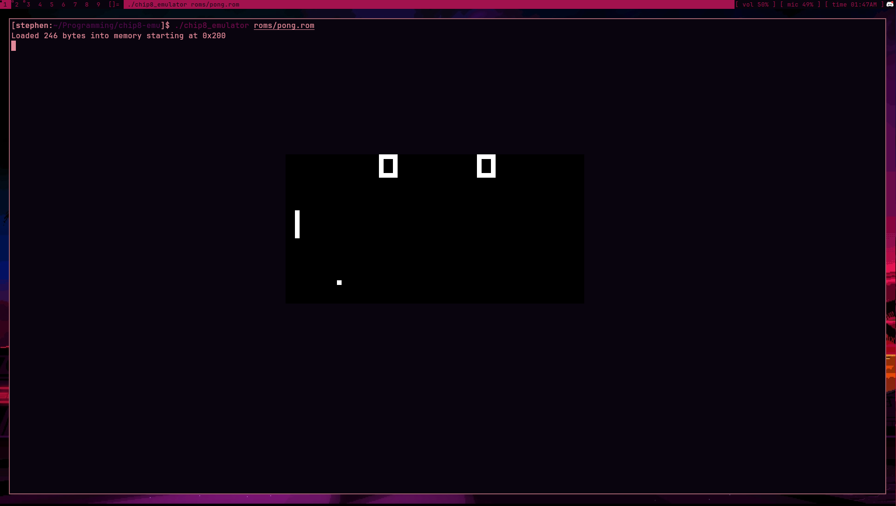

# chip8emu

### Resources
- https://multigesture.net/articles/how-to-write-an-emulator-chip-8-interpreter/
- https://en.wikipedia.org/wiki/CHIP-8#cite_note-rcaops-25
- ChatGPT YAY!!!!!!!!!!1

### Install
`make clean && make`

### Usage
`./chip8_emulator <ROM>`
